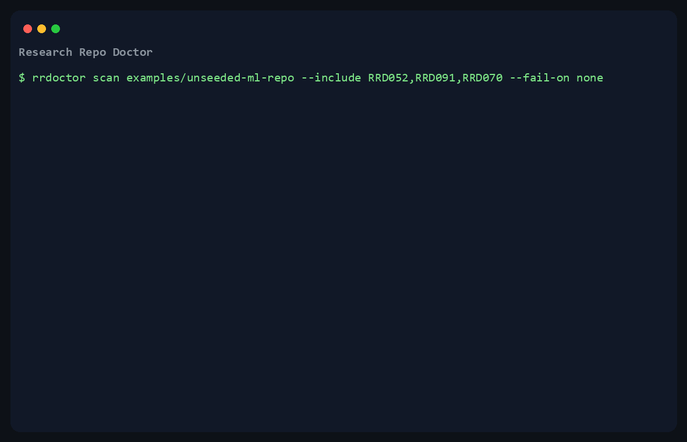

# Research Repo Doctor

Get your research artifact ready for Artifact Evaluation before the deadline:
scan the repo, scaffold the easy fixes, verify the run path, and generate the appendix.

Hosted demo: <https://research-repo-doctor-bckncrcwwmg6jrbsrd6btj.streamlit.app/>
Or run the local static scan without installing:

```bash
uvx rrdoctor scan .
```

Streamlit may take a minute to wake the hosted app after inactivity.



[](https://github.com/Tom409114/research-repo-doctor/actions/workflows/ci.yml)
[](https://github.com/Tom409114/research-repo-doctor)
[](LICENSE)
[](pyproject.toml)

`rrdoctor` is a local CLI and GitHub Action for research artifact preparation. It audits
whether a repo is reviewable, citable, and close to runnable; scaffolds safe mechanical
fixes; maps findings to an AE-style readiness level; and turns the rest into a checklist
any coding agent or human can finish.

## AE deadline loop

```bash
uvx rrdoctor prepare . --profile acm --out-dir rrdoctor-prep

# Or run the pieces explicitly:
uvx rrdoctor scan . --profile acm
uvx rrdoctor fix . --write
uvx rrdoctor appendix . --profile acm --output ARTIFACT_APPENDIX.md
uvx rrdoctor verify . --profile acm
uvx rrdoctor verify . --profile acm --run --timeout 600 --fail-on error  # trusted repos only
# Or pin the official quickstart command as the dynamic gate:
uvx rrdoctor verify . --profile acm --command "python train.py config/default.py" --run --timeout 600 --fail-on error
```

For trusted repositories, `rrdoctor verify --run` can go beyond static checks and actually
resolve dependencies and execute the declared entrypoint under a timeout. With the default
gate (`--fail-on error`), failed or blocked dynamic L2/L3 steps return a nonzero exit code.
Use `--command` when the artifact has a specific smoke-test or quickstart command that
reviewers should run.
`rrdoctor prepare` writes the report, agent plan, artifact appendix, and verification ladder
into one local evidence directory.

Artifact Evaluation chairs and lab maintainers can use the
[AE chair guide](docs/ae-chair-guide.md) for optional pre-submission wording and
CI examples.

## What it catches

- **"Your `--seed` flag does nothing."** `RRD052` spots code that declares a seed option but
  never calls `random.seed`, `np.random.seed`, `torch.manual_seed`, `tf.random.set_seed`, or
  `random_state=seed`.
- **"This worked on my laptop."** Local-only data paths, missing data provenance, and
  undocumented retrieval steps.
- **"The environment silently changed."** Unpinned dependencies, missing runtime versions,
  undeclared imports, and absent dependency manifests.
- **"The notebook lies."** Stale outputs, out-of-order execution, checkpoint artifacts, and
  secret-like notebook output.
- **"Reviewers cannot tell how to cite or rerun this."** Missing license, citation, CI,
  tests, changelog, results provenance, or experiment entrypoint.

## Install

Run once, without installing:

```bash
uvx rrdoctor scan .
```

Alternatives:

```bash
pipx run rrdoctor scan .
pip install rrdoctor
rrdoctor scan .
```

Developer install from source:

```bash
git clone https://github.com/Tom409114/research-repo-doctor.git
cd research-repo-doctor
python -m pip install -e ".[dev]"
rrdoctor scan .
```

## Fix the easy gaps

Let `rrdoctor` create the safe scaffolding for you. It is deterministic, idempotent, and
never overwrites existing files.

```bash
rrdoctor fix . --write
```

It can scaffold missing governance docs, citation metadata, data/results provenance notes,
a reproducible-seed helper, changelog entries, and common research `.gitignore` entries.
The hard parts become a reviewable plan:

```bash
rrdoctor plan . --output plan.md
```

## Use with your coding agent

Paste this into Claude Code, Cursor, GitHub Copilot, or any other coding agent:

```text
Use rrdoctor as the deterministic, offline, no-API-key grader for this research repo.

Run:
rrdoctor scan . --format json --output baseline.json
rrdoctor plan . --output plan.md

Work through plan.md without weakening rrdoctor checks.

Definition of done:
rrdoctor scan . --baseline baseline.json --fail-on-new error
```

The final command is the objective gate: it verifies the agent's work against the starting
baseline and fails only on newly introduced errors.

Copyable agent templates are available for Agent Skills / Claude Code-style workflows and
Cursor project rules under [integrations/](integrations/).

Keywords: research software, reproducibility, artifact evaluation, repository audit, auto-fix,
coding agents, AGENTS.md, GitHub Action, notebooks, data availability, citation metadata.

## Help calibrate the rules

The fastest way to improve rrdoctor is real scan feedback from real research
repositories. If a finding looks wrong, missing, or too severe, please open a
[false-positive](https://github.com/Tom409114/research-repo-doctor/issues/new?template=false_positive.yml),
[false-negative](https://github.com/Tom409114/research-repo-doctor/issues/new?template=false_negative.yml),
[scan-case](https://github.com/Tom409114/research-repo-doctor/issues/new?template=scan_case.yml),
or [new-rule](https://github.com/Tom409114/research-repo-doctor/issues/new?template=rule_request.yml)
issue. Include the rule ID, command, rrdoctor version, and a sanitized minimal
repo shape. See [feedback and calibration](docs/feedback.md) for the short checklist.

## Why this matters

Research code often lands on GitHub under deadline pressure. A reviewer or future lab
member finds a promising repository and then loses hours because the environment is
underspecified, data paths are local, notebooks contain stale outputs, dependencies are
unpinned, or the citation is unclear.

Research Repo Doctor turns those recurring release blockers into deterministic checks with
concrete remediation - and, where it is safe to do so, scaffolds the mechanical starting
points. It is built to sit in the ordinary maintenance path: run locally while preparing
a release, then run automatically on pull requests through GitHub Actions.

The audit runs without an AI API key, network access, or hosted service. That same
determinism makes it an honest grader: it can verify fixes made by a person or a coding
agent.

```text
audit -> fix -> plan -> (your coding agent / you) -> verify -> PR
  |       |       |                                  |
  |       |       rrdoctor plan                      rrdoctor scan --baseline
  |       rrdoctor fix --write                       --fail-on-new error
  rrdoctor scan
```

## What's new in 0.2.20

- **Lower-noise mature scientific package scans**: `RRD010` now recognizes
  common license filenames such as `LICENSE.txt`, and `RRD043` ignores
  CI/devcontainer paths, tests/fixtures, URL path segments, and documented
  placeholder/example absolute paths.
- **Lower-noise library and secret heuristics**: `RRD050` no longer treats
  mature package/library projects, including common nested `package/` layouts,
  as missing paper experiment entrypoints, and `RRD090` ignores URL query
  tokens, local function-call or method-call token variables, generic fake
  tokens in test helpers, and provider-looking substrings embedded inside
  longer biological/test sequences.
- **More reviewed corpus evidence**: SciPy is a focused review case and an
  expected-absent regression gate for `RRD010` and `RRD043`; scikit-image,
  JAX, NetworkX, Keras, Transformers, PyTorch Lightning, Biopython,
  torchvision, MDAnalysis, QuTiP, ESM, stable-diffusion, detectron2,
  DINO, StyleGAN2-ADA PyTorch, instant-ngp, Big Vision, latent-diffusion,
  taming-transformers, generative-models, pytorch-image-models, Brax, ArviZ,
  PyMC, Pyro, TensorFlow Probability, statsmodels, and Optax add first-run trust
  gates or focused review evidence. The latest 80-repository corpus gate has 0
  expected-absent regressions, 67 reviewed notes, and 13 repositories still
  awaiting focused review.
- **Less template-like auto-fix output**: `rrdoctor fix --write` can now read
  simple literal `setup.py` metadata statically, without executing repository
  code, when generating citation and provenance scaffolds.
- **More filled Artifact Appendix access notes**: `rrdoctor appendix` reuses the
  same local metadata inference to pre-fill repository URLs and versions for
  legacy `setup.py`/`setup.cfg` projects.
- **More realistic L2 environment checks**: `rrdoctor verify --run` now resolves
  common nested Python requirement files such as `requirements/base.txt` and
  `requirements/main.txt`, plus `.yaml` Conda environment files, instead of
  skipping those repository layouts.
- **Lower-noise notebook secret checks**: `RRD063` now shares the test/fixture
  generic fake-token suppression used by `RRD090`, while still flagging
  standalone provider-style keys.

## What's new in 0.2.19

- **Lower-noise experiment entrypoint detection**: `RRD050` now recognizes
  package-level research binaries such as `t5x/train.py`, documented
  `python3 ${T5X_DIR}/t5x/train.py` commands, and notebook-first artifacts with
  clearly named demo/example/reproduce notebooks such as `graphcast_demo.ipynb`.
- **More first-run corpus evidence**: focused review notes now cover 32/60 seed
  corpus repositories. The latest 60-repository static corpus scan has 0
  expected-absent regressions and keeps t5x and GraphCast as entrypoint
  regression gates.

## What's new in 0.2.18

- **Lower-noise dependency checks**: `RRD034` now parses Python AST imports
  instead of regex-matching source text, so comments, docstrings, and prose
  examples do not look like missing packages.
- **Runtime-focused dependency signal**: docs, tests, benchmarks, vendored code,
  maintainer tooling, `conftest.py`, build-system requirements, and local
  sibling modules are filtered out before dependency-gap reporting.
- **More corpus review evidence**: focused review notes now cover 30/60 seed
  corpus repositories, including scikit-learn, Astropy, scvi-tools, and DINOv2
  checks for dependency-signal noise.
- **Current install path**: PyPI, GitHub Action examples, demo requirements,
  citation metadata, and the self-scan report are aligned to this release.

## What's new in 0.2.15

- **Clearer verification evidence**: `rrdoctor verify` reports now lead with
  the gate outcome, failure threshold, timeout, trust boundary, rerun command,
  and the source of any L3 dynamic command.
- **Stronger Artifact Appendix scaffolding**: `rrdoctor appendix` now pre-fills
  local README/project metadata, dependency manifests, data/results docs,
  config files, and detected entrypoint commands where available.
- **More useful generated data notes**: `rrdoctor fix --write` carries over
  candidate dataset URLs, DOIs, README data commands, and local data scripts
  when scaffolding `DATA.md`.
- **Maintainer launch gates**: `python scripts/check.py` and
  `python scripts/check_public_readiness.py` provide cross-platform local checks
  for release, JOSS, Artifact Evaluation, and public outreach readiness.

## What's new in 0.2.14

- **One-command AE evidence packet**: `rrdoctor prepare` writes the static
  report, agent fix plan, Artifact Appendix, and verification ladder into one
  local directory for deadline handoff.
- **CI-uploaded AE packet**: the GitHub Action now supports `prepare: "true"`
  and `prepare-output`, so pull requests and release gates can upload the same
  reviewer-ready packet.
- **Pinned run-path verification**: `verify --command "..."`, the Action
  `verify-command` input, and the MCP `verify` tool let maintainers pin the
  official quickstart command and timeout as the L3 gate.
- **Lower first-run noise**: MAE-style root `main_*.py` scripts, AlphaFold-style
  `random_seed=` plumbing, test-file randomness, and placeholder absolute paths
  are handled more conservatively.

## What's new in 0.2.13

- **Scan reports now lead to the AE workflow**: Markdown reports and agent fix
  plans now include next-step commands for `rrdoctor plan`, `rrdoctor appendix`,
  static `rrdoctor verify`, and trusted-only dynamic `verify --run`.
- **Stronger auto-fix scaffolds**: generated `AGENTS.md` files now include the
  scan -> plan -> baseline verification loop, and generated results-provenance
  notes include local repository context, current result files, and a structured
  result inventory table.
- **Better adoption materials**: public docs now include a feedback/calibration
  path and an Artifact Evaluation chair guide with optional pre-submission
  wording and CI examples.

## What's new in 0.2.12

- **Trusted dynamic Action gate**: GitHub Action users can now set
  `verify-run: "true"` plus `verify-fail-on: error` so trusted dynamic
  verification blocks CI while still uploading the verification report.
- **Agent distribution templates**: repository Copilot instructions, an Agent
  Skill template, and a Cursor project rule make the deterministic
  scan -> plan -> verify loop copyable across coding-agent workflows.
- **Tighter evidence wording**: corpus and JOSS draft wording now distinguishes
  focused review notes from full manual repository audits.

## What's new in 0.2.11

- **First-run trust tuning**: README install/run commands, seeded local RNGs,
  PyTorch parameter initialization, UUID-like identifiers, and classic ML repos
  now produce fewer false positives.
- **Real dynamic gate**: `rrdoctor verify --run --fail-on error` now exits
  nonzero when dependency resolution or the detected run path fails or is blocked.
- **More calibration evidence**: 22 focused review notes are now committed,
  including BERT, CLIP, improved-diffusion, MAE, and AlphaFold follow-ups with
  expected-absent checks for fixed noisy findings.

## What's new in 0.2.10

- **More reliable corpus calibration**: the public evaluation-corpus runner now
  falls back to GitHub archives when `git clone` times out, keeping first-run
  trust checks less dependent on flaky transport.
- **Cleaner maintainer automation**: first-party workflows and documentation
  examples now use current Node 24-compatible GitHub Actions releases.
- **Sharper diagnostics**: `rrdoctor doctor` now reports optional MCP
  integration availability only when the package and import-time dependencies
  actually load.

## What's new in 0.2.9

- **Clearer first-run CLI behavior**: `rrdoctor --version` now reports the
  installed package version, and running bare `rrdoctor` prints the root help
  page successfully.

## What's new in 0.2.8

- **Better README run-path recognition**: README-documented
  `python -m package.train ...` commands now count as experiment entrypoints
  when they map to local repository modules.
- **Stronger dynamic verification for ML launchers**: `rrdoctor verify` now
  recognizes module-runner commands such as
  `python -m torch.distributed.run train.py ...` when they include a local
  Python entrypoint.

## What's new in 0.2.7

- **Better citation scaffolds**: `rrdoctor fix --write` now reads structured
  PEP 621 and Poetry metadata, preserves multiple authors, normalizes SSH git
  remotes, and handles git worktree origin URLs when generating `CITATION.cff`.
- **Lower-noise dependency checks**: `RRD034` now understands PEP 621 environment
  markers and Poetry dependency groups, reducing undeclared-import false positives.

## What's new in 0.2.6

- **Lower-noise secret checks**: Rcpp `Generator token` markers and public
  pkgdown `docsearch.api_key` search configuration no longer trigger `RRD090`,
  while generic credential-like API keys still do.
- **More reliable corpus scans**: the evaluation runner now falls back to
  GitHub archive downloads when `git clone` transport is flaky, without
  installing or executing target repositories.
- **More manual calibration evidence**: the current public corpus snapshot
  covers 60/60 successful static scans, 22 focused review notes loaded in that
  snapshot, and 0 expected-absent regressions.

## What's new in 0.2.5

- **Model-release entrypoints**: README-documented `python scripts/*.py` /
  `python tools/*.py` commands and pyproject-declared CLI commands now count as
  experiment entrypoints, reducing first-run false positives on repositories
  such as Segment Anything and Whisper.
- **ML tools entrypoints**: common `tools/train.py`, `tools/test.py`, and
  related ML framework commands now count for `RRD050`.
- **Seed helper scaffolding**: `rrdoctor fix --write` can scaffold a
  reproducible `set_global_seed(seed)` helper for `RRD052` without overwriting
  project code.
- **Corpus regression gates**: entrypoint fixes are backed by focused review
  notes and `expected_absent` checks in the public evaluation corpus.

## What's new in 0.2.4

- **First-run trust improvements**: root-level `train.py`/`main.py`/`run.py`,
  Snakemake/Nextflow workflows, and README run commands count as experiment entrypoints.
- **Lower-noise security checks**: notebook and repository secret detection now requires
  high-confidence credential-like values before raising blocking errors.
- **More realistic README checks**: concrete training, evaluation, benchmark, workflow, or
  reproduction commands count as evidence for reproducing results.
- **Corpus-backed rule calibration**: the public evaluation corpus tracks false-positive and
  false-negative review notes, expected-absent regression gates, and aggregate rule frequencies.
- **Release hygiene**: citation guidance detection recognizes README Citing sections, BibTeX,
  DOI links, and "please cite" text; local git tags count as deterministic version evidence.
- **Release polish**: the demo GIF is generated, issue access is open, and the committed
  self-scan report is 100/100.

## What's new in 0.2.0

- **`rrdoctor fix`** provides deterministic, idempotent auto-fix for common gaps (governance
  docs, citation metadata, data/results provenance, seed helper scaffolding, changelog, ignore
  entries). Never overwrites.
- **`rrdoctor plan`** emits a tool-agnostic fix plan you can hand to any coding agent; every
  task names the deterministic check that verifies it.
- **Baseline gating**: `rrdoctor scan --baseline report.json --fail-on-new error` fails only
  on newly introduced findings, so large repos can adopt the audit incrementally.
- **`rrdoctor badge`** emits a Shields.io endpoint or SVG artifact-readiness badge.
- **Artifact readiness labels** map findings to an AE-style level: `Available`,
  `Functional`, or `Reproduced-ready`. The numeric score remains as a secondary
  triage signal.
- **First-class PR automation**: the Action posts a sticky PR comment, writes a job summary,
  and can attach the fix plan, using only the built-in `GITHUB_TOKEN`.
- **New rules** include unpinned dependencies, committed notebook checkpoints, pre-commit
  config, and an AGENTS.md task guide for agent and human contributors.

## Quickstart

```bash
rrdoctor scan .                   # deterministic audit (Markdown report)
rrdoctor fix . --write            # apply safe scaffolding for easy gaps
rrdoctor plan . --output plan.md  # tool-agnostic work order for the rest
rrdoctor scan . --format json --output baseline.json --fail-on none
rrdoctor scan . --baseline baseline.json --fail-on-new error  # gate regressions
```

Stricter gate and report file:

```bash
rrdoctor scan . --profile strict --fail-on warning --output rrdoctor-report.md
```

Machine-readable and agent output:

```bash
rrdoctor scan . --format sarif --output rrdoctor.sarif --fail-on none
rrdoctor scan . --format agent --output fix-plan.md
```

Before a submission deadline:

```bash
rrdoctor prepare . --profile acm --out-dir rrdoctor-prep          # one local AE packet
rrdoctor appendix . --profile acm --output ARTIFACT_APPENDIX.md   # appendix + checklist mapping
rrdoctor verify . --profile neurips                               # L1/L2/L3 ladder (static)
rrdoctor verify . --run --timeout 600 --fail-on error              # build + run gate (trusted repos)
rrdoctor verify . --command "python train.py config/default.py" --run --timeout 600
```

Submission profiles: `acm`, `neurips`, `icml`, `ml-paper`, `fair4rs`, `joss` (alongside the
general `minimal`/`standard`/`strict`/`ml` tiers). Dependency and runtime checks also understand
R (`DESCRIPTION`, `renv.lock`) and Julia (`Project.toml`), not just Python and JavaScript.

## The audit -> fix -> verify loop

A deterministic checker is reproducible and trustworthy but cannot write prose or judge
intent. A coding agent edits well but needs a precise specification and an objective
definition of done. Research Repo Doctor gives you both:

1. **Audit**: `rrdoctor scan` produces deterministic findings.
2. **Fix the easy ones**: `rrdoctor fix --write` scaffolds governance docs, citation metadata,
   provenance notes, a seed helper, a changelog, and ignore entries (idempotent, never
   overwriting).
3. **Plan the rest**: `rrdoctor plan` emits a tool-agnostic work order. Paste it into the
   coding agent of your choice, attach it to an issue, or work it by hand.
4. **Verify**: re-run the audit against a baseline. Because verification is deterministic
   and key-free, it works as an honest grader for changes from any source.

See [docs/agent-workflows.md](docs/agent-workflows.md) and [docs/autofix.md](docs/autofix.md).

## GitHub Action

Add one workflow to many repositories and get consistent reproducibility reports on pull
requests and pushes. The Action requires no API key.

```yaml
name: Reproducibility audit

on:
  pull_request:

permissions:
  contents: read
  pull-requests: write

jobs:
  rrdoctor:
    runs-on: ubuntu-latest
    steps:
      - uses: actions/checkout@v7
      - uses: Tom409114/research-repo-doctor@v0.2.20
        with:
          profile: standard
          fail-on: none
          comment-pr: "true"     # sticky PR comment with the report
          step-summary: "true"   # report in the job summary
          plan: "true"           # attach an agent-ready fix plan
          appendix: "true"       # attach an Artifact Evaluation appendix
          verify: "true"         # attach the L1/L2/L3 verification ladder
          prepare: "true"        # upload a complete AE prep packet directory
          # For trusted repos, add verify-run: "true" and verify-fail-on: error
```

For new-finding gating and a committed baseline, see
[docs/pull-request-automation.md](docs/pull-request-automation.md).

## Example output

```text
Research Repo Doctor Summary
Profile: standard
Readiness: Functional
Score: 64/100
Errors: 0
Warnings: 5
Rules evaluated: 32

How to fix first:
- RRD030 No dependency manifest found: Add pyproject.toml, requirements.txt, or another manifest.
- RRD040 Data availability documentation missing: Add DATA.md, docs/data.md, or a README section.
```

Worked examples live in [examples/reports/](examples/reports/), including a
[fix plan](examples/reports/fix-plan.md) and a [self-scan report](examples/reports/self-scan-report.md).

## Commands

| Command | Purpose |
| --- | --- |
| `rrdoctor scan` | Run the deterministic audit; supports `--baseline` and `--fail-on-new`. |
| `rrdoctor fix` | Apply safe, idempotent scaffolding for common gaps (`--write` to apply). |
| `rrdoctor plan` | Emit a tool-agnostic fix plan (Markdown or JSON). |
| `rrdoctor prepare` | Write a local AE prep packet: report, plan, appendix, and verification. |
| `rrdoctor verify` | Reproducibility ladder L1/L2/L3; `--command` pins the official quickstart; `--run` actually builds and executes. |
| `rrdoctor appendix` | Generate an ACM Artifact Appendix + ACM/NeurIPS checklist mapping. |
| `rrdoctor badge` | Emit an artifact-readiness badge (Shields.io endpoint or SVG). |
| `rrdoctor mcp` | Run the MCP server (`scan`/`verify`/`appendix` as agent tools). |
| `rrdoctor init` | Write a documented `.rrdoctor.yml`. |
| `rrdoctor list-rules` | List all registered rules. |
| `rrdoctor explain RRD0xx` | Explain a rule and how to remediate it. |
| `rrdoctor doctor` | Self-diagnostics. |
| `rrdoctor --version` | Show the installed package version. |

## Rule categories

Documentation, environment, data, experiments, notebooks, citation, governance, testing,
CI, security, release, and metadata. The full table is in [docs/checks.md](docs/checks.md);
auto-fixable rules are marked there.

## Reproducibility stance

Research Repo Doctor does not claim to prove a paper is reproducible. It checks release
hygiene that makes reproduction possible to attempt. Reports are heuristic and should be
reviewed by maintainers. Generated fixes are starting points and contain placeholders to
complete before release.

## Philosophy

Deterministic first. The scanner is understandable, testable, and useful with no network
access. The core scanner will not add network calls, require a hosted-service API key, or
fabricate adoption metrics. AI is something you bring to act on the output - never a
dependency of the audit itself, and never tied to a single tool.

## Configuration

```yaml
version: 1
profile: standard
paths:
  exclude: [".git", ".venv", "node_modules", "__pycache__"]
thresholds:
  large_file_mb: 50
  large_notebook_output_kb: 1024
rules:
  RRD032:
    enabled: false
  RRD042:
    severity: warning
fail_on: error
```

See [docs/configuration.md](docs/configuration.md).

## Contributing

Contributions are welcome. Start with [CONTRIBUTING.md](CONTRIBUTING.md) and [AGENTS.md](AGENTS.md),
open a rule request or false-positive report, and include a minimal fixture when possible.

## Security

Do not report suspected credential exposure in a public issue. See [SECURITY.md](SECURITY.md).

## Citation

Use the included [CITATION.cff](CITATION.cff) or cite the archived release DOI:
[10.5281/zenodo.21045373](https://doi.org/10.5281/zenodo.21045373).

A JOSS-style draft manuscript is available in [paper/](paper/) for review. It is
not a submitted manuscript and intentionally avoids unverified adoption claims;
formal submission metadata will be updated only when it is true.

```bibtex
@software{research_repo_doctor_2026,
  title = {Research Repo Doctor},
  author = {{Research Repo Doctor Maintainers}},
  version = {0.2.20},
  year = {2026},
  doi = {10.5281/zenodo.21045373},
  url = {https://github.com/Tom409114/research-repo-doctor}
}
```

## License

MIT. See [LICENSE](LICENSE).
